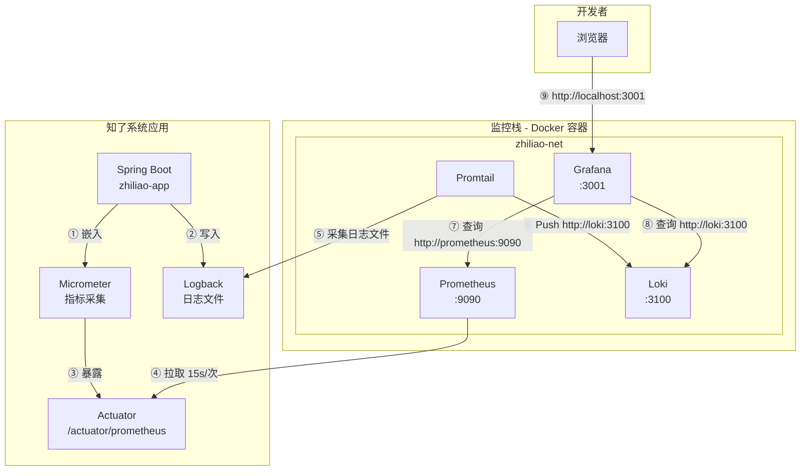
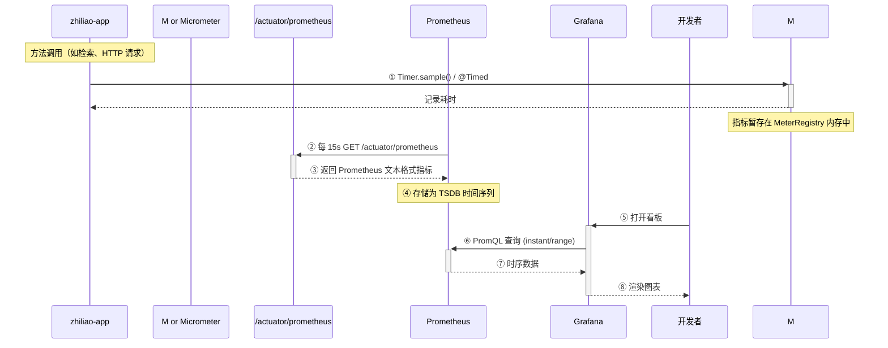
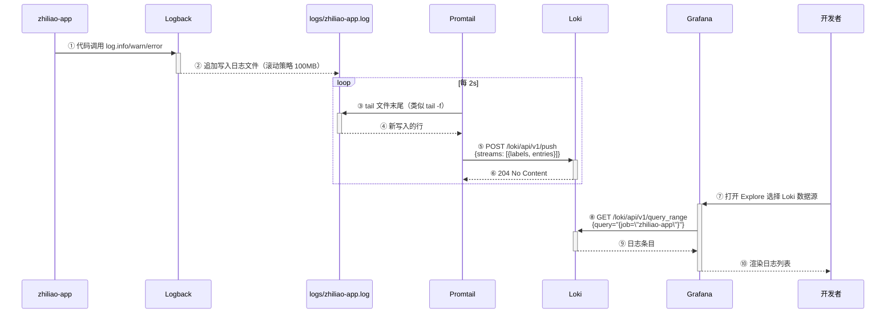
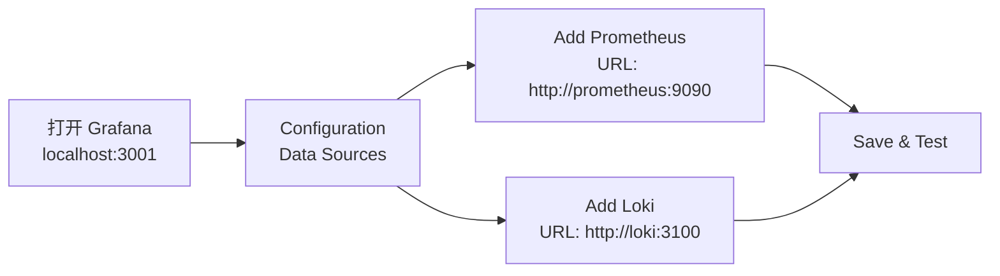

# 可观测性监控架构

## 总览

知了知了系统采用 **Prometheus + Grafana + Loki** 轻量组合搭建可观测性栈，覆盖 Metrics（指标）和 Logging（日志）两个可观测性支柱。

```
┌──────────────────────────────────────────────────────────────────┐
│                      可观测性三大支柱                             │
├──────────────┬──────────────────┬───────────────────────────────┤
│   Metrics    │     Logging      │          Tracing              │
│   (指标)      │     (日志)       │         (链路追踪)            │
├──────────────┼──────────────────┼───────────────────────────────┤
│  Prometheus  │  Loki + Promtail │  未纳入（模块化单体优先级低）    │
│  + Grafana   │  + Grafana      │                               │
└──────────────┴──────────────────┴───────────────────────────────┘
```

---

## 架构总览



| 组件 | 角色 | 部署方式 | 核心端口 |
|------|------|---------|---------|
| **Micrometer + Actuator** | 应用内指标采集和暴露 | 嵌入 Spring Boot | 8080 (`/actuator/prometheus`) |
| **Prometheus** | 指标拉取、存储、告警 | Docker | 9090 |
| **Loki** | 日志聚合存储 | Docker | 3100 |
| **Promtail** | 日志采集器，读文件推 Loki | Docker | 无对外端口 |
| **Grafana** | 指标和日志可视化看板 | Docker | 3001 |

---

## 组件详解

### 1. Micrometer — 应用内指标仪

**定位**：Spring Boot 的事实标准指标门面（Facade），类似 SLF4J 之于日志。

**工作原理**：

```
方法调用 → Micrometer @Timed 注解 / Timer.sample()
          → MeterRegistry 注册指标
          → PrometheusMeterRegistry 格式化为 Prometheus 文本格式
          → Actuator 暴露为 /actuator/prometheus
```

**核心 API**：

| 指标类型 | 用途 | 示例 |
|---------|------|------|
| `Counter` | 只增不减的计数器 | 请求总数、缓存命中次数 |
| `Timer` | 耗时分布统计 | 检索延迟 P50/P95/P99 |
| `Gauge` | 可增可减的瞬时值 | 当前在线连接数、内存使用量 |
| `DistributionSummary` | 分布统计 | 响应体大小分布 |

**接入方式**（声明式）：

```java
@Aspect
@Component
public class RetrievalMetricsAspect {

    private final Timer denseSearchTimer;

    public RetrievalMetricsAspect(MeterRegistry registry) {
        this.denseSearchTimer = Timer.builder("retrieval.dense.duration")
            .description("Milvus 稠密检索延迟")
            .publishPercentiles(0.5, 0.95, 0.99)  // P50, P95, P99
            .register(registry);
    }

    @Around("execution(* org.liar.zhiliao.retrieval.tools.KnowledgeRetrievalTool.retrieveKnowledge(..))")
    public Object measureDenseSearch(ProceedingJoinPoint pjp) throws Throwable {
        return denseSearchTimer.recordCallable(pjp::proceed);
    }
}
```

**Actuator 端点暴露配置**（`application.yaml`）：

```yaml
management:
  endpoints:
    web:
      exposure:
        include: health,info,prometheus,metrics
  endpoint:
    prometheus:
      enabled: true
```

---

### 2. Prometheus — 指标存储与告警

**定位**：Pull 模式的时间序列数据库。

**关键概念**：

| 概念 | 说明 | 类比 |
|------|------|------|
| **Metric** | 指标名，如 `http_requests_total` | 表名 |
| **Label** | 键值对标签，如 `method="GET"`, `status="200"` | 索引列 |
| **Sample** | 时间戳 + 值，如 `@1234567890 42` | 行 |
| **Target** | 被抓取的目标，如 `host.docker.internal:8080` | 数据源 |
| **Scrape** | 按间隔拉取指标数据 | ETL 抽取 |

**数据模型**：

```
metric_name{label1="value1",label2="value2"} <value> <timestamp>
```

真实示例（`/actuator/prometheus` 返回）：

```
# HELP jvm_memory_used_bytes The amount of used memory
# TYPE jvm_memory_used_bytes gauge
jvm_memory_used_bytes{area="heap",id="G1 Eden Space",} 8.388608e7 1721260800000

http_server_requests_seconds_count{method="GET",status="200",uri="/chat/chat"} 152 1721260800000
http_server_requests_seconds_sum{method="GET",status="200",uri="/chat/chat"} 45.32 1721260800000
```

**Prometheus 配置文件**（`prometheus.yml`）：

```yaml
global:
  scrape_interval: 15s               # 每 15s 拉取一次
  evaluation_interval: 15s           # 每 15s 评估告警规则

scrape_configs:
  - job_name: 'zhiliao-app'
    metrics_path: '/actuator/prometheus'
    static_configs:
      - targets: ['host.docker.internal:8080']   # 宿主机上运行的 Spring Boot
```

**核心 API**：

| API | 用途 | 示例 |
|-----|------|------|
| `GET /api/v1/query?query=<PromQL>` | 瞬时查询 | `rate(http_requests_total[5m])` |
| `GET /api/v1/query_range?query=&start=&end=&step=` | 范围查询 | 看板图表数据 |
| `GET /api/v1/targets` | 查看所有抓取目标状态 | 调试用 |

**PromQL 示例**（Prometheus 查询语言）：

```promql
# 最近 5 分钟 chat 接口的平均 QPS
rate(http_server_requests_seconds_count{uri="/chat/chat"}[5m])

# 检索延迟 P95（基于自定义指标）
histogram_quantile(0.95, rate(retrieval_dense_duration_seconds_bucket[5m]))

# 缓存命中率
retrieval_cache_hit_total / (retrieval_cache_hit_total + retrieval_cache_miss_total)

# JVM 堆内存使用率
jvm_memory_used_bytes{area="heap"} / jvm_memory_max_bytes{area="heap"}
```

**数据保留配置**：

```bash
# 启动参数控制，两种策略同时生效（谁先触发清理谁）
--storage.tsdb.retention.time=7d      # 保留 7 天
--storage.tsdb.retention.size=200MB   # 数据超过 200MB 自动清理旧数据
```

---

### 3. Loki — 日志聚合

**定位**：受 Prometheus 启发的日志系统，使用相同的 Label 机制。

**与 ELK 的核心区别**：

| 特性 | ELK (Elasticsearch) | Loki |
|------|-------------------|------|
| 索引方式 | 全文索引 | Label 索引 + 日志内容不索引 |
| 存储成本 | 高（全量索引） | 低（仅索引 Label） |
| 查询性能 | 全文搜索快 | Label 过滤快，内容搜索较慢 |
| 与 Prometheus 集成 | 无原生集成 | Grafana 原生一体化 |
| 资源占用 | 重（ES 需要数 GB 内存） | 轻（~200MB 内存） |

**工作原理**：

```
Promtail 推送 → Loki HTTP API (/loki/api/v1/push)
              → ingester 写入内存 → 刷写到对象存储(boltdb-shipper + filesystem)
              → compactor 合并和清理过期数据
```

**Loki 配置要点**（`loki-config.yml`）：

```yaml
compactor:
  retention_enabled: true
  retention_rules:
    - type: age
      age: 7d                                    # 日志保留 7 天

limits_config:
  ingestion_rate_mb: 10                           # 每个 ingester 最大写入速率
  ingestion_burst_size_mb: 20                     # 突发写入上限
  max_query_lookback: 168h                       # 查询只能看 7 天内的数据
```

**LogQL 示例**（Loki 查询语言，和 PromQL 风格一致）：

```logql
# 查询指定 job 的所有日志
{job="zhiliao-app"}

# 包含关键字的日志
{job="zhiliao-app"} |= "ERROR"

# 按正则过滤
{job="zhiliao-app"} |~ "Exception|NullPointer"

# 带时间范围的日志量统计
rate({job="zhiliao-app"}[5m])
```

---

### 4. Promtail — 日志采集器

**定位**：日志的 agent，部署在应用同一台机器上，tail 日志文件并推送到 Loki。

**工作原理**：

```yaml
scrape_configs:
  - job_name: zhiliao-app
    static_configs:
      - targets: [localhost]
        labels:
          job: zhiliao-app
          service: liar-zhiliao
          __path__: /var/log/zhiliao/*.log    # 监听的日志文件路径
```

**运行流程**：

```
Promtail 启动
  → 读取 positions.yaml（记录已读到哪个文件哪行，防止重复推送）
  → 根据 __path__ 匹配日志文件
  → tail 新写入的行
  → 添加 Label (job, service)
  → POST http://loki:3100/loki/api/v1/push
```

**为什么需要 Promtail 而不是 Logback 直推 Loki**：

| 方案 | 优点 | 缺点 |
|------|------|------|
| Logback 直推 Loki | 架构简单，无中间件 | 侵入应用代码；应用挂则日志丢；阻塞写影响性能 |
| Logback → 文件 → Promtail | 无侵入；app 不感知 Loki；Promtail 自动重试 | 多一个进程 |

---

### 5. Grafana — 统一可视化

**定位**：指标和日志的统一看板，对接 Prometheus 和 Loki 双数据源。

**数据源配置**：

| 数据源 | URL | 作用 |
|--------|-----|------|
| Prometheus | `http://prometheus:9090` | 查询指标绘制图表 |
| Loki | `http://loki:3100` | 查询日志展示在 Explore |

**看板类型**：

| 看板 | 用途 | 数据源 |
|------|------|--------|
| Spring Boot 概览 | JVM 内存、GC、线程、HTTP 请求量 | Prometheus |
| 检索性能 | 检索延迟 P50/P95/P99、缓存命中率 | Prometheus |
| 对话分析 | 对话 QPS、Token 消耗、用户活跃 | Prometheus |
| 日志探索 | 实时日志搜索、错误排查 | Loki |

---

## 数据流转详解

### 路径 A：指标采集流程



**关键时序**：

```
T0      应用启动 → Micrometer 初始化 → Actuator 端点就绪
T0+15s  Prometheus 首次拉取（scrape_interval=15s）
T0+30s  第二次拉取，开始有 2 个数据点
T+任意  Grafana 查询，PromQL 计算 rate/delta
```

**指标种类**（Actuator 自动暴露 + 自定义）：

| 指标 | 来源 | 示例值 |
|------|------|--------|
| `jvm_memory_used_bytes` | Actuator 自动 | 堆内存 512MB |
| `jvm_gc_pause_seconds` | Actuator 自动 | GC 暂停 50ms |
| `http_server_requests_seconds_count` | Actuator 自动 | `/chat/chat` 调用 152 次 |
| `http_server_requests_seconds_sum` | Actuator 自动 | 总耗时 45.32s |
| `retrieval_dense.duration` | 自定义 @Timed | 稠密检索 P50=120ms |
| `retrieval_cache_hit_total` | 自定义 Counter | 缓存命中 89 次 |
| `retrieval_cache_miss_total` | 自定义 Counter | 缓存未命中 23 次 |

---

### 路径 B：日志采集流程



**Promtail 推送到 Loki 的请求体**：

```json
{
  "streams": [
    {
      "stream": {
        "job": "zhiliao-app",
        "service": "liar-zhiliao"
      },
      "values": [
        ["1721260800000000000", "2026-07-18 10:00:00.123 INFO  [http-nio-8080] c.l.ZhiliaoApplication - 应用启动完成"],
        ["1721260801000000000", "2026-07-18 10:00:01.456 WARN  [http-nio-8080] o.l.zhiliao.chat.ChatController - 限流触发 memoryId=xxx"]
      ]
    }
  ]
}
```

---

## Grafana 看板使用

### 数据源配置



### 指标查询 vs 日志查询

| 场景 | 数据源 | 查询语言 | 操作入口 |
|------|--------|---------|---------|
| 查看 QPS 趋势 | Prometheus | PromQL | Dashboard / Explore |
| 查看接口 P99 延迟 | Prometheus | PromQL | Dashboard |
| 搜索错误日志 | Loki | LogQL | Explore |
| 看板关联跳转日志 | 双数据源 | — | 图表 → View in Explore |

### 典型 PromQL 查询

```promql
# 按接口分组的 QPS 排名
sum by (uri) (rate(http_server_requests_seconds_count[5m]))

# 5xx 错误率
sum(rate(http_server_requests_seconds_count{status=~"5.."}[5m]))
/
sum(rate(http_server_requests_seconds_count[5m]))

# 检索延迟对比（P50 vs P95 vs P99）
histogram_quantile(0.50, rate(retrieval_dense_duration_seconds_bucket[5m]))
histogram_quantile(0.95, rate(retrieval_dense_duration_seconds_bucket[5m]))
histogram_quantile(0.99, rate(retrieval_dense_duration_seconds_bucket[5m]))
```

---

## 与知了系统的集成点

### 已集成的组件

| 集成点 | 涉及文件 | 作用 |
|--------|---------|------|
| Actuator 端点 | `application.yaml` `management.*` | 暴露 /actuator/prometheus |
| Micrometer 依赖 | `zhiliao-app/pom.xml` | `micrometer-registry-prometheus` |
| 日志文件输出 | `logback-spring.xml` | 滚动日志文件供 Promtail 采集 |
| 自定义检索指标 | `RetrievalMetricsAspect`（待实现） | 检索延迟、缓存命中率 |
| 限流降级指标 | `ChatController`（待实现） | @RateLimiter 触发次数 |

### 尚未集成的（Phase 3 后续）

| 功能 | 预期实现方式 |
|------|------------|
| Redis 两级缓存 | `@Cacheable` 注解 + `CacheConfig` |
| Resilience4j 限流熔断 | `@RateLimiter` + `@CircuitBreaker` 注解 |
| 管理后台 REST API | `zhiliao-admin` 模块 + `AdminFilter` |
| Spring Security OAuth2 Client | 替换手写 OAuth2 |

---

## 启动与验证

### 启动顺序

```
1. docker network create zhiliao-net     # 创建网络（首次）
2. mvn spring-boot:run -pl zhiliao-app   # 启动应用
3. docker run prometheus                 # 启动指标采集
4. docker run loki                       # 启动日志存储
5. docker run promtail                   # 启动日志采集
6. docker run grafana                    # 启动可视化
```

### 验证命令

```bash
# Prometheus 是否正常抓取
curl localhost:9090/api/v1/targets | jq

# Loki 是否就绪
curl localhost:3100/ready

# 应用是否暴露指标
curl localhost:8080/actuator/prometheus | head -20

# Grafana 是否可访问
curl localhost:3001/api/health
```

---

## 关键设计要点

1. **Pull 模式 vs Push 模式**：Prometheus 采用 Pull（主动拉取），而非 Push（推送）。优势是应用不需感知监控系统的存在，Prometheus 自己控制采集节奏。Loki 采用 Push，因为日志数据量大，不适合 Prometheus 反向拉取。

2. **Label 驱动**：Prometheus 和 Loki 都使用 Label 作为唯一索引方式。指标查询和日志过滤都依赖 Label 匹配，设计 Label 时要考虑基数（Cardinality）——高基数 Label（如 user_id）会导致性能问题。

3. **一体化的可观测性**：Grafana 同时对接 Prometheus（指标）和 Loki（日志），可以在同一页面从指标异常（如 5xx 突增）一键跳转到对应时间点的日志详情，实现 Metrics-driven Incident Response。

4. **轻量设计**：相比 ELK（Elasticsearch 数十 GB 内存），Loki + Promtail 仅 ~300MB。适配中小企业内部系统的资源约束。

5. **应用零感知**：Micrometer 和 Logback 是应用的标准依赖，不直接感知 Prometheus/Loki 存在。更换监控后端（如从 Prometheus 换到 VictoriaMetrics）只需改配置，不改代码。

6. **缓存的监控闭环**：缓存命中率是核心指标——命中率低意味着需要优化缓存策略或增大缓存容量，而缓存优化又可以减少 LLM 调用和检索延迟，形成正向循环。
