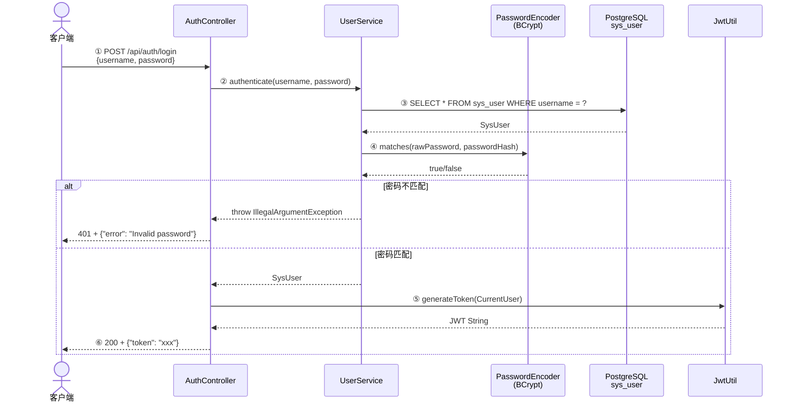

# 登录流程

## 入口

```
① 用户名密码登录：POST /api/auth/login       → AuthController.login()        # AuthController.java:24
② GitHub OAuth2：  GET  /oauth2/github        → OAuth2Controller.githubAuthorize()  # OAuth2Controller.java:42
③ 钉钉扫码：       GET  /oauth2/dingtalk/authorize → OAuth2Controller.dingtalkAuthorizeUrl()  # OAuth2Controller.java:94
   OAuth2 回调：    GET  /oauth2/{provider}/callback  → OAuth2Controller.callback()  # OAuth2Controller.java:54
```

三种登录方式最终都返回 **JWT**（通过 `Cookie` 或 `Response Body`），后续请求在 `Authorization: Bearer <token>` 头中携带，由 `JwtFilter` 校验。

---

## 架构总览

```mermaid
graph TB
    Client[客户端 / 浏览器]

    subgraph Auth [zhiliao-auth 模块]
        AC[AuthController<br/>用户名密码登录]
        OAC[OAuth2Controller<br/>OAuth2 登录入口 + 回调]
        JF[JwtFilter<br/>@Order=1 请求鉴权]

        subgraph OAuth2_Core [OAuth2 核心]
            IFACE[OAuth2Authenticator<br/>认证器接口]
            GHA[GitHubAuthenticator]
            DTA[DingTalkAuthenticator]
            WCA[WeChatAuthenticator<br/>空壳预留]
        end

        subgraph User [用户服务]
            ULS[UserLinkService<br/>邮箱合并 + 自动创建用户]
            US[UserService<br/>用户名密码认证]
        end
    end

    subgraph Common [zhiliao-common 模块]
        JWT[JwtUtil<br/>签发 + 校验 JWT]
        CU[CurrentUser<br/>用户身份 record]
        UCH[UserContextHolder<br/>ThreadLocal 上下文]
    end

    subgraph DB [PostgreSQL]
        SU[(sys_user)]
        SOL[(sys_oauth_link)]
        SD[(sys_department)]
        ZDV[(zl_kb_dept_visibility)]
    end

    subgraph ThirdParty [第三方 OAuth 平台]
        GH[GitHub API]
        DT[钉钉开放平台]
    end

    Client -->|POST /api/auth/login| AC
    Client -->|GET /oauth2/*| OAC

    AC --> US --> JWT --> Client

    OAC --> IFACE
    IFACE --> GHA --> GH
    IFACE --> DTA --> DT
    OAC --> ULS --> SU
    OAC --> ULS --> SOL
    OAC --> JWT --> Client

    JF --> JWT --> CU --> UCH

    GHA --> GH
    DTA --> DT
```

---

## 核心组件职责

| 组件 | 文件 | 职责 |
|------|------|------|
| `AuthController` | `auth/controller/AuthController.java` | 用户名密码登录，验证后签发 JWT |
| `OAuth2Controller` | `auth/controller/OAuth2Controller.java` | OAuth2 登录入口 + 统一回调，签发 JWT Cookie |
| `OAuth2Authenticator` | `auth/oauth2/OAuth2Authenticator.java` | **接口**：`provider()` 返回名称，`authenticate(code)` 用授权码换取用户信息 |
| `GitHubAuthenticator` | `auth/oauth2/impl/GitHubAuthenticator.java` | GitHub OAuth2 实现：code → token → 用户信息 + 邮箱 |
| `DingTalkAuthenticator` | `auth/oauth2/impl/DingTalkAuthenticator.java` | 钉钉扫码实现：authCode → userAccessToken → 用户信息 |
| `UserLinkService` | `auth/service/UserLinkService.java` | 邮箱合并：根据 OAuth 返回信息关联已有用户或创建新用户 |
| `UserService` | `auth/service/UserService.java` | 用户名密码认证（BCrypt） |
| `JwtFilter` | `auth/filter/JwtFilter.java` | 请求鉴权 filter，`@Order=1`，跳过 `/api/auth/login` 和 `/oauth2/*` |
| `JwtUtil` | `common/utils/JwtUtil.java` | JWT 签发/校验/解析，含 `visibleDeptIds` 声明 |
| `CurrentUser` | `common/model/CurrentUser.java` | 用户身份 record：(id, username, deptId, visibleDeptIds) |
| `UserContextHolder` | `common/utils/UserContextHolder.java` | ThreadLocal 存储当前请求的用户身份 |
| `OAuth2Config` | `auth/oauth2/OAuth2Config.java` | `@ConfigurationProperties("oauth2")` 绑定各平台 client-id/secret/redirect-uri |

---

## 路径 A：用户名密码登录

**触发条件**：用户通过表单提交用户名和密码。



### 关键源码

```java
// AuthController.java — 用户名密码登录入口
@PostMapping("/login")
public ResponseEntity<?> login(@RequestBody Map<String, String> request) {
    String username = request.get("username");
    String password = request.get("password");

    // 调用 UserService 验证用户名密码（BCrypt 比对）
    SysUser user = userService.authenticate(username, password);

    // 构造当前用户身份 → 签发 JWT
    CurrentUser currentUser = new CurrentUser(user.getId(), user.getUsername(), user.getDeptId());
    String token = jwtUtil.generateToken(currentUser);
    return ResponseEntity.ok(Map.of("token", token));
}

// UserServiceImpl.java — BCrypt 密码验证
public SysUser authenticate(String username, String password) {
    SysUser user = userMapper.selectOne(
        Wrappers.<SysUser>lambdaQuery().eq(SysUser::getUsername, username));
    if (!passwordEncoder.matches(password, user.getPasswordHash())) {
        throw new IllegalArgumentException("Invalid password");
    }
    return user;
}
```

---

## 路径 B：GitHub OAuth2 授权码登录

**触发条件**：用户点击"GitHub 登录"按钮。

**OAuth2 授权码流程**：[RFC 6749 Section 4.1](https://datatracker.ietf.org/doc/html/rfc6749#section-4.1)

```
用户浏览器                        知了系统后端                           GitHub
    │                                │                                    │
    │  ① GET /oauth2/github          │                                    │
    │ ──────────────────────────────>│                                    │
    │                                │                                    │
    │  ② 302 重定向（含 state 防 CSRF）                                   │
    │ <──────────────────────────────│                                    │
    │                                │                                    │
    │  ③ 浏览器跳转 GitHub 授权页                                        │
    │ ──────────────────────────────────────────────────────────────────>│
    │                                │                                    │
    │  ④ 用户登录 GitHub + 确认授权                                      │
    │                                │                                    │
    │  ⑤ GitHub 302 回调                                              │
    │ <──────────────────────────────────────────────────────────────────│
    │   redirect_uri?code=xxx&state=yyy                                  │
    │                                │                                    │
    │  ⑥ GET /oauth2/github/callback?code=xxx&state=yyy                  │
    │ ──────────────────────────────>│                                    │
    │                                │  ⑦ 校验 state（防 CSRF）           │
    │                                │  ⑧ POST /login/oauth/access_token │
    │                                │     {code, client_id, secret}      │
    │                                │ ──────────────────────────────────>│
    │                                │  ⑨ access_token                    │
    │                                │ <──────────────────────────────────│
    │                                │  ⑩ GET /user (Bearer token)        │
    │                                │ ──────────────────────────────────>│
    │                                │  ⑪ {id, login, ...}                │
    │                                │ <──────────────────────────────────│
    │                                │  ⑫ GET /user/emails (Bearer token) │
    │                                │ ──────────────────────────────────>│
    │                                │  ⑬ [{email, primary}, ...]         │
    │                                │ <──────────────────────────────────│
    │                                │                                    │
    │                                │  ⑭ 邮箱合并 (UserLinkService)      │
    │                                │  ⑮ 签发 JWT                        │
    │                                │                                    │
    │  ⑯ 302 + Set-Cookie: zhiliao_token=JWT                            │
    │ <──────────────────────────────│                                    │
    │                                │                                    │
    │  ✅ 已登录，后续请求带 JWT Cookie                                   │
```

### 三方系统如何授权

**GitHub** 使用标准 OAuth2 授权码流程：

| 步骤 | HTTP 方法 | URL | 请求参数 | 响应 |
|------|-----------|-----|---------|------|
| ① 引导授权 | GET（浏览器跳转） | `https://github.com/login/oauth/authorize` | `client_id`, `redirect_uri`, `scope=user:email`, `state` | 用户看到授权页 |
| ⑤ 回调 | GET（GitHub → 浏览器 → 后端） | `redirect_uri?code=xxx&state=yyy` | `code`, `state` | — |
| ⑧ 换 token | POST（后端 → GitHub） | `https://github.com/login/oauth/access_token` | `client_id`, `client_secret`, `code`, `redirect_uri` | `{"access_token":"..."}` |
| ⑩ 取用户信息 | GET（后端 → GitHub） | `https://api.github.com/user` | Header: `Authorization: Bearer <token>` | `{"id":123,"login":"..."}` |
| ⑫ 取邮箱 | GET（后端 → GitHub） | `https://api.github.com/user/emails` | Header: `Authorization: Bearer <token>` | `[{"email":"a@b.com","primary":true}]` |

### 关键源码

```java
// OAuth2Controller.java 第①步 — 引导用户跳转 GitHub 授权页
@GetMapping("/oauth2/github")
public void githubAuthorize(HttpServletRequest request, HttpServletResponse response) throws IOException {
    OAuth2Config.ProviderConfig github = config.getGithub();

    // 生成随机 state，存入 session，防 CSRF 攻击
    String state = UUID.randomUUID().toString();
    request.getSession(true).setAttribute("oauth_state", state);

    // 拼接 GitHub 授权 URL → 302 跳转
    String url = String.format(
        "https://github.com/login/oauth/authorize?client_id=%s&redirect_uri=%s&scope=user:email&state=%s",
        github.getClientId(), github.getRedirectUri(), state);
    response.sendRedirect(url);
}

// OAuth2Controller.java 第⑥步 — 统一回调入口
@GetMapping("/oauth2/{provider}/callback")
public void callback(@PathVariable String provider, @RequestParam("code") String code,
                     @RequestParam(value = "state", required = false) String state,
                     HttpServletRequest request, HttpServletResponse response) throws IOException {

    // CSRF 防护：仅 GitHub 校验 state
    if ("github".equals(provider)) {
        HttpSession session = request.getSession(false);
        String savedState = (session != null) ? (String) session.getAttribute("oauth_state") : null;
        if (savedState == null || !savedState.equals(state)) {
            response.sendError(401, "Invalid OAuth state parameter");
            return;
        }
        session.removeAttribute("oauth_state");  // 一次性使用
    }

    // 按 provider 名称路由到对应认证器
    OAuth2Authenticator authenticator = authenticators.stream()
        .filter(a -> a.provider().equals(provider))
        .findFirst()
        .orElseThrow(() -> new IllegalArgumentException("Unknown OAuth provider: " + provider));

    // 用授权码换取用户信息
    OAuth2UserInfo userInfo = authenticator.authenticate(code);

    // 邮箱合并：关联已有用户或创建新用户
    SysUser user = userLinkService.linkOrCreate(userInfo, provider);

    // 签发 JWT + 设置 HttpOnly Cookie → 302 首页
    List<Long> visibleDeptIds = deptPermissionService.getVisibleDeptIds(user.getDeptId());
    CurrentUser currentUser = CurrentUser.of(user.getId(), user.getUsername(), user.getDeptId(), visibleDeptIds);
    String token = jwtUtil.generateToken(currentUser);

    Cookie jwtCookie = new Cookie("zhiliao_token", token);
    jwtCookie.setPath("/");
    jwtCookie.setHttpOnly(true);
    jwtCookie.setMaxAge(86400);  // 1 天
    response.addCookie(jwtCookie);
    response.sendRedirect("/");
}
```

```java
// GitHubAuthenticator.java — 三步 OAuth2 流程
@Component
public class GitHubAuthenticator implements OAuth2Authenticator {
    public String provider() { return "github"; }

    public OAuth2UserInfo authenticate(String code) {
        // ① code → access_token（POST 后端到 GitHub，不走浏览器）
        String accessToken = getAccessToken(code);

        // ② access_token → 用户信息（id, login）
        Map<String, Object> userInfo = getUserInfo(accessToken);

        // ③ access_token → 用户邮箱列表 → 取 primary 邮箱
        String email = getPrimaryEmail(accessToken);

        return new OAuth2UserInfo(
            String.valueOf(userInfo.get("id")),  // providerUserId
            email,                                 // 用于跨平台邮箱合并
            (String) userInfo.getOrDefault("login", "")  // name
        );
    }

    // Step 1: POST https://github.com/login/oauth/access_token
    // Body: {client_id, client_secret, code, redirect_uri}
    // Response: {"access_token": "gho_xxx", "scope": "user:email", "token_type": "bearer"}
    private String getAccessToken(String code) { /* RestTemplate 调用 */ }

    // Step 2: GET https://api.github.com/user
    // Header: Authorization: Bearer <access_token>
    // Response: {"id": 12345, "login": "peijiarui", ...}
    private Map<String, Object> getUserInfo(String accessToken) { /* RestTemplate 调用 */ }

    // Step 3: GET https://api.github.com/user/emails
    // Response: [{"email": "a@b.com", "primary": true, "verified": true}, ...]
    // 遍历取 primary == true 的邮箱，失败返回 null
    private String getPrimaryEmail(String accessToken) { /* RestTemplate 调用 */ }
}
```

---

## 路径 C：钉钉扫码登录

**触发条件**：用户在 PC 浏览器看到钉钉二维码，用手机钉钉扫码。

**OAuth2 授权码流程**：与 GitHub 相同，但第③步用户不在浏览器操作，而是在手机上扫码确认。

```
PC浏览器              知了系统后端              前端页面              钉钉开放平台          手机钉钉
    │                     │                      │                      │                  │
    │  ① GET /oauth2/     │                      │                      │                  │
    │     dingtalk/authorize                     │                      │                  │
    │ ────────────────────>│                      │                      │                  │
    │  ② {"authUrl":"https://login.dingtalk.com/oauth2/auth?...client_id=...&redirect_uri=..."} │
    │ <────────────────────│                      │                      │                  │
    │                     │                      │                      │                  │
    │  ③ 前端用 authUrl 生成二维码展示在页面                        │                  │
    │ <─────────────────────────────────────────>│                      │                  │
    │                     │                      │                      │                  │
    │  ④ 用户打开钉钉 App 扫码                                              │                  │
    │ ─ ─ ─ ─ ─ ─ ─ ─ ─ ─ ─ ─ ─ ─ ─ ─ ─ ─ ─ ─ ─ ─ ─ ─ ─ ─ ─ ─ ─ ─ ─ ─ ─ ─ ─>│
    │                     │                      │                      │                  │
    │  ⑤ 钉钉弹出授权确认页                                                                     │
    │ <─ ─ ─ ─ ─ ─ ─ ─ ─ ─ ─ ─ ─ ─ ─ ─ ─ ─ ─ ─ ─ ─ ─ ─ ─ ─ ─ ─ ─ ─ ─ ─ ─ ─ ─│
    │                     │                      │                      │                  │
    │  ⑥ 用户点击"确认授权"                                                                      │
    │ ─ ─ ─ ─ ─ ─ ─ ─ ─ ─ ─ ─ ─ ─ ─ ─ ─ ─ ─ ─ ─ ─ ─ ─ ─ ─ ─ ─ ─ ─ ─ ─ ─ ─ ─>│
    │                     │                      │                      │                  │
    │                     │  ⑦ 钉钉 302 回调 redirect_uri?code=xxx     │                  │
    │                     │ <──────────────────────────────────────────│                  │
    │                     │                      │                      │                  │
    │  ⑧ 前端检测到二维码状态变化→转发回调到后端                                           │
    │ ────────────────────────────────────────────────────────────────────────────────────│
    │  GET /oauth2/dingtalk/callback?code=xxx                                             │
    │ ────────────────────>│                      │                      │                  │
    │                     │                      │                      │                  │
    │                     │  ⑨ POST /v1.0/oauth2/userAccessToken                          │
    │                     │     {clientId, clientSecret, code, grantType}                 │
    │                     │ ──────────────────────────────────────────────────────────────>│
    │                     │  ⑩ {"accessToken":"xxx"}                                      │
    │                     │ <──────────────────────────────────────────────────────────────│
    │                     │                      │                      │                  │
    │                     │  ⑪ GET /v1.0/contact/users/me                                │
    │                     │     Header: x-acs-dingtalk-access-token: xxx                  │
    │                     │ ──────────────────────────────────────────────────────────────>│
    │                     │  ⑫ {"unionId":"xxx","nick":"张三","email":"..."}              │
    │                     │ <──────────────────────────────────────────────────────────────│
    │                     │                      │                      │                  │
    │                     │  ⑬ 邮箱合并 + 签发 JWT + Cookie + 302 首页                     │
    │  ⑭ 已登录           │                      │                      │                  │
    │ <────────────────────│                      │                      │                  │
```

### 三方系统如何授权

**钉钉** 使用 OAuth2 授权码流程（与 GitHub 原理相同，API 端点不同）：

| 步骤 | HTTP 方法 | URL | 关键差异 |
|------|-----------|-----|---------|
| ① 引导授权 | 后端返回 authUrl，前端生成二维码 | `https://login.dingtalk.com/oauth2/auth` | **非浏览器跳转**，用户用手机扫码 |
| ⑦ 回调 | GET（钉钉 → 浏览器 → 后端） | `redirect_uri?code=xxx` | 与 GitHub 相同 |
| ⑨ 换 token | POST（后端 → 钉钉） | `https://api.dingtalk.com/v1.0/oauth2/userAccessToken` | Body 为 **JSON**（非 form），字段：`clientId`, `clientSecret`, `code`, `grantType` |
| ⑪ 取用户信息 | GET（后端 → 钉钉） | `https://api.dingtalk.com/v1.0/contact/users/me` | Header 用 **`x-acs-dingtalk-access-token`**（非 `Authorization: Bearer`） |

### 关键源码

```java
// OAuth2Controller.java — 返回钉钉授权 URL（前端生成二维码用）
@GetMapping("/oauth2/dingtalk/authorize")
public ResponseEntity<Map<String, String>> dingtalkAuthorizeUrl() {
    OAuth2Config.ProviderConfig dingtalk = config.getDingtalk();

    // 拼接钉钉授权 URL（不带 state，钉钉扫码场景 CSRF 风险较低）
    String url = String.format(
        "https://login.dingtalk.com/oauth2/auth?redirect_uri=%s&response_type=code&client_id=%s&scope=openid&prompt=consent",
        dingtalk.getRedirectUri(), dingtalk.getClientId());

    // 返回 JSON，前端用此 URL 生成二维码
    return ResponseEntity.ok(Map.of("authUrl", url));
}

// 回调复用统一入口 callback()，provider = "dingtalk"，逻辑与 GitHub 完全相同
```

```java
// DingTalkAuthenticator.java — 两步获取用户信息
@Component
public class DingTalkAuthenticator implements OAuth2Authenticator {
    public String provider() { return "dingtalk"; }

    public OAuth2UserInfo authenticate(String code) {
        // ① authCode → userAccessToken
        String accessToken = getUserAccessToken(code);

        // ② accessToken → 用户信息（unionId, nick, email）
        Map<String, Object> userInfo = getUserInfo(accessToken);

        return new OAuth2UserInfo(
            (String) userInfo.get("unionId"),   // providerUserId
            (String) userInfo.get("email"),     // 钉钉不保证返回邮箱，可能为 null
            (String) userInfo.getOrDefault("nick", "")
        );
    }

    // Step 1: POST https://api.dingtalk.com/v1.0/oauth2/userAccessToken
    // Body (JSON): {"clientId":"...","clientSecret":"...","code":"...","grantType":"authorization_code"}
    // Response: {"accessToken":"xxx", "expireIn":7200}
    private String getUserAccessToken(String code) { /* RestTemplate 调用 */ }

    // Step 2: GET https://api.dingtalk.com/v1.0/contact/users/me
    // Header: x-acs-dingtalk-access-token: <accessToken>  ← 注意：非标准 Bearer
    // Response: {"unionId":"xxx", "nick":"张三", "avatarUrl":"...", "email":"..."}
    private Map<String, Object> getUserInfo(String accessToken) { /* RestTemplate 调用 */ }
}
```

---

## 邮箱合并逻辑 (UserLinkService)

**设计目的**：用户通过 GitHub（有邮箱）和钉钉（有邮箱）登录时，如果邮箱一致，自动识别为同一用户。

```
OAuth2UserInfo.email
    │
    ├── sys_oauth_link 已有 (provider, providerUserId) 记录？
    │   ├── 是 → 直接返回关联的 sys_user（老用户二次登录）
    │   └── 否 → 继续
    │
    ├── email 非空？
    │   ├── 是 → sys_user 中 username == email 已存在？
    │   │   ├── 是 → 关联到该用户，创建 sys_oauth_link（跨平台合并）
    │   │   └── 否 → 创建新用户 + sys_oauth_link
    │   └── 否 → 创建新用户（username = provider + "_" + providerUserId）+ sys_oauth_link
    │
    └── 返回 SysUser
```

### 关键源码

```java
// UserLinkService.java — 邮箱合并核心逻辑
@Transactional
public SysUser linkOrCreate(OAuth2UserInfo userInfo, String provider) {
    // ① 查 OAuth 关联记录
    SysOauthLink existingLink = oauthLinkMapper.selectOne(
        Wrappers.<SysOauthLink>lambdaQuery()
            .eq(SysOauthLink::getProvider, provider)
            .eq(SysOauthLink::getProviderUserId, userInfo.providerUserId()));
    if (existingLink != null) {
        return userMapper.selectById(existingLink.getUserId());   // 老用户，直接返回
    }

    // ② 邮箱非空 → 尝试按邮箱合并
    if (userInfo.email() != null && !userInfo.email().isBlank()) {
        SysUser userByEmail = userMapper.selectOne(
            Wrappers.<SysUser>lambdaQuery().eq(SysUser::getUsername, userInfo.email()));
        if (userByEmail != null) {
            createOauthLink(userByEmail.getId(), provider, userInfo);  // 绑定到已有用户
            return userByEmail;
        }
    }

    // ③ 创建新用户（OAuth 用户无密码）
    SysUser newUser = SysUser.builder()
        .username(/* email 或 provider_providerUserId */)
        .passwordHash("")    // OAuth 用户无需密码登录
        .role("USER")
        .tenantId("default")
        .deptId(1L)
        .build();
    userMapper.insert(newUser);
    createOauthLink(newUser.getId(), provider, userInfo);
    return newUser;
}
```

---

## JWT 结构与请求鉴权

### Token 声明

```json
// JWT Payload
{
  "sub": "1",                    // userId
  "username": "peijiarui",
  "deptId": 1,
  "visibleDeptIds": [1, 2, 3],  // RBAC 部门可见性
  "iat": 1750000000,
  "exp": 1750086400              // 1 天有效期
}
```

### 请求鉴权流程

```
客户端请求 → JwtFilter.doFilter()
    │
    ├── path == "/api/auth/login" 或 path.startsWith("/oauth2/")？
    │   └── 是 → 放行（登录接口不做鉴权）
    │
    ├── Authorization: Bearer <token> 存在且有效？
    │   ├── 是 → parseToken → UserContextHolder.set(currentUser) → 放行
    │   └── 否 → 401 Unauthorized
    │
    └── finally: UserContextHolder.clear()  // 防止 ThreadLocal 泄漏
```

---

## 外部资源调用统计

| 登录方式 | GitHub API 调用 | 钉钉 API 调用 | PostgreSQL 查询 | 说明 |
|----------|:-------------:|:------------:|:--------------:|------|
| 用户名密码 | 0 | 0 | 1 次（查 sys_user） | 最低开销 |
| GitHub 新用户 | 3 次 | 0 | 2-3 次（查 OAuth 记录 + 查邮箱 + 插入） | access_token → user → emails |
| GitHub 老用户 | 3 次 | 0 | 1 次（查 OAuth 记录） | 已有关联记录直接返回 |
| 钉钉新用户 | 0 | 2 次 | 2-3 次 | userAccessToken → users/me |
| 钉钉老用户 | 0 | 2 次 | 1 次 | 同上 |

> **GitHub 必须调 3 次 API**：因为 GitHub 的 `/user` 端点不返回邮箱，邮箱需要另外调 `/user/emails`。
> **钉钉调 2 次 API**：`userAccessToken` + `users/me`，用户信息接口已含邮箱（但钉钉不保证一定返回）。

---

## 关键设计要点

1. **接口-实现分离**：`OAuth2Authenticator` 接口 + `List<OAuth2Authenticator>` 注入，新增登录平台只需新增一个 `@Component` 实现类，`OAuth2Controller` 无需修改
2. **邮箱合并**：同一邮箱的 GitHub/钉钉账号自动识别为同一用户，`sys_oauth_link` 表负责记录关联关系
3. **CSRF 防护**：GitHub OAuth 通过 session 存储随机 `state`，回调时校验，一次性使用后销毁
4. **HttpOnly Cookie**：JWT 通过 `Set-Cookie` 返回，`httpOnly=true` 防 XSS 窃取
5. **JWT 不存敏感信息**：Token 只含 userId/username/deptId/visibleDeptIds，不含密码
6. **ThreadLocal 清理**：`JwtFilter` 在 `finally` 块中 `UserContextHolder.clear()`，防止线程池复用导致的内存泄漏
7. **钉钉特殊 Header**：钉钉 API 使用 `x-acs-dingtalk-access-token` 而非标准 `Authorization: Bearer`，在 `DingTalkAuthenticator` 中单独处理
8. **微信预留**：`WeChatAuthenticator` 类已创建，`@Component` 注释掉，`authenticate()` 抛 `UnsupportedOperationException`，后续只需实现 + 取消注释即可接入
9. **OAuth 用户无密码**：通过 OAuth 创建的用户 `passwordHash = ""`，无法通过用户名密码登录，只能通过 OAuth 登录
