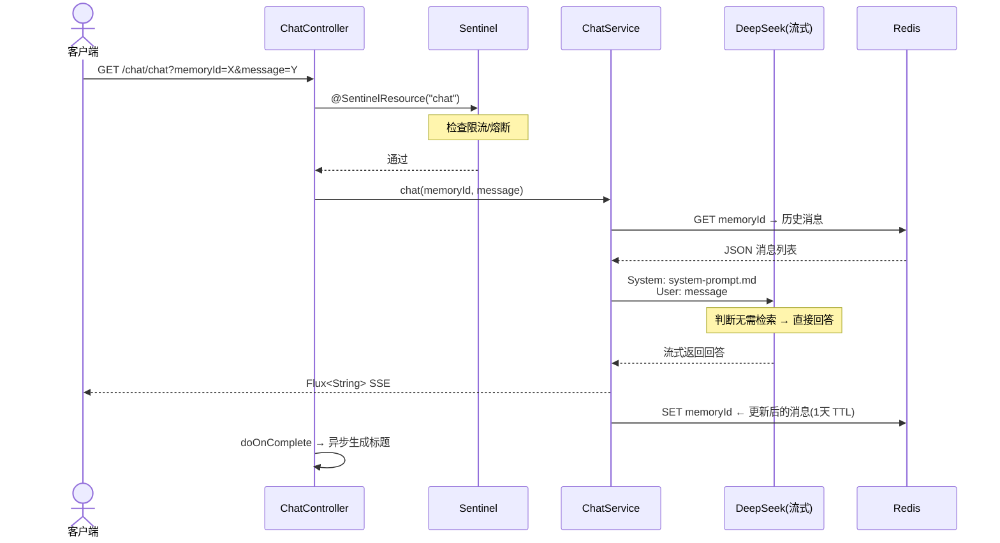
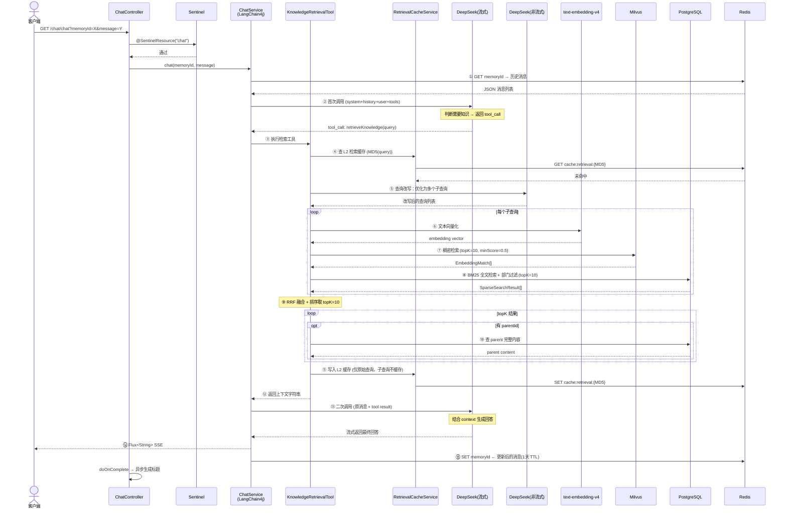
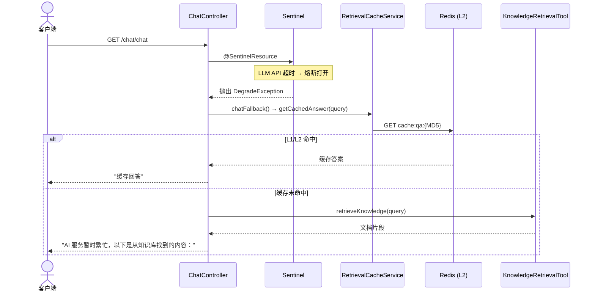
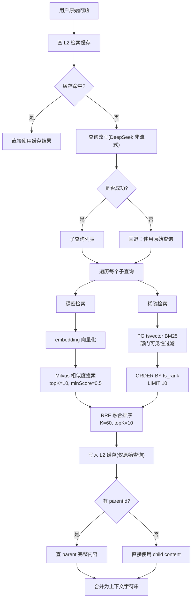
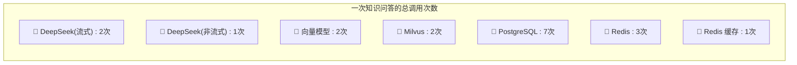

# Chat 请求流程

## 入口

```
GET /chat/chat?memoryId=X&message=Y
  → ChatController.chat()                        # ChatController.java:44
    → [Sentinel] @SentinelResource("chat")       # 限流 + 熔断
      → 被限流 → chatBlockHandler()              # 返回 "请求过于频繁"
      → 被熔断 → chatFallback()                  # L1 缓存 → 检索文档片段
    → ChatService.chat(memoryId, message)        # @AiService 接口，LangChain4j 运行时生成
      → Flux<String> SSE 流式响应 (text/html)
```

`ChatService` 绑定的组件：

| 引用 | Bean 名称 | 类型 | 作用 |
|------|-----------|------|------|
| `streamingChatModel` | `openAiStreamingChatModel` | `OpenAiStreamingChatModel` | 流式调用 DeepSeek |
| `chatModel` (tools 内) | `openAiChatModel` | `OpenAiChatModel` | 非流式调用 DeepSeek（查询改写） |
| `chatMemoryProvider` | `chatMemoryProvider` | `ChatMemoryProvider` | 按 memoryId 管理会话 |
| `chatMemory` | `chatMemory` | `ChatMemory` | 会话记忆对象 |
| `tools` | `knowledgeRetrievalTool` | `KnowledgeRetrievalTool` | 知识检索工具 |
| `@SystemMessage` | `system-prompt.md` | — | AI 角色设定 |

---

## 架构总览

```mermaid
graph TB
    Client[客户端]

    subgraph Sentinel [限流熔断层]
        SN[Sentinel<br/>@SentinelResource]
        SN_BLOCK[chatBlockHandler<br/>限流 → 提示重试]
        SN_FALL[chatFallback<br/>熔断 → 缓存/文档]
    end

    subgraph Controller [zhiliao-chat]
        CC[ChatController]
    end

    subgraph Cache [两级缓存]
        L1[L1 Caffeine<br/>1000条/10min]
        L2[L2 Redis<br/>qa:1h / retrieval:24h]
        RCS[RetrievalCacheService]
    end

    subgraph Service [zhiliao-chat]
        CS[ChatService<br/>@AiService]
        SPM[system-prompt.md]
    end

    subgraph Memory [记忆层]
        CM[ChatMemoryProvider]
        MWC[MessageWindowChatMemory<br/>maxMessages=20]
        CMS[CustomChatMemoryStore]
        REDIS_M[(Redis<br/>1天 TTL)]
    end

    subgraph Tool [知识检索]
        KRT[KnowledgeRetrievalTool]
        EM[text-embedding-v4]
        MILVUS[(Milvus)]
        PG[(PostgreSQL<br/>zl_chunk)]
    end

    subgraph Metrics [检索指标]
        RM[RetrievalMetrics<br/>8 个 Micrometer 指标]
        PROM[Prometheus<br/>/actuator/prometheus]
    end

    subgraph LLM [模型层]
        DS_STREAM[DeepSeek 流式]
        DS_SYNC[DeepSeek 非流式]
    end

    Client -->|GET /chat/chat| CC
    CC -->|@SentinelResource| SN
    SN -->|通过| CS
    SN -->|限流| SN_BLOCK
    SN -->|熔断| SN_FALL
    SN_FALL -->|查 L1| L1
    SN_FALL -->|查文档| KRT

    CS -->|system prompt| SPM
    CS -->|读写会话| CM
    CM --> MWC
    MWC --> CMS
    CMS --> REDIS_M

    CS ==自由对话==> DS_STREAM
    CS ==知识问答==> KRT

    KRT -->|L2 缓存| RCS
    RCS --> L2
    KRT -->|查询改写| DS_SYNC
    KRT -->|稠密检索| EM --> MILVUS
    KRT -->|稀疏检索| PG

    KRT -.->|指标埋点| RM
    CS -.->|指标埋点| RM
    RM --> PROM
```

---

## 路径 A：自由对话（不涉及知识库）

**触发条件**：问候、感谢、闲聊、自我介绍等非知识类问题。



---

## 路径 B：知识问答（涉及知识库）

**触发条件**：询问公司制度、政策、流程、产品信息等企业内部知识。



### 熔断降级流程



### 检索管线内部流程



---

## 外部资源调用统计

以一次典型知识问答为例：查询改写产生 **2 个子查询**，topK=10 中有 **5 个 chunk 带 parentId**。



| 资源 | Bean | 调用次数 | 时机与目的 |
|------|------|---------|-----------|
| **DeepSeek 流式** | `openAiStreamingChatModel` | **2 次** | ① 首次：发消息，LLM 返回 tool_call<br>② 二次：发消息 + tool 返回的 context，LLM 生成最终回答 |
| **DeepSeek 非流式** | `openAiChatModel` | **1 次** | `rewriteQuery()` 内改写用户问题为多个检索关键词 |
| **向量模型** | `embeddingModel` | **2 次** | 每个子查询 1 次：文本 → 向量，供 Milvus 检索 |
| **Milvus** | `milvusEmbeddingStore` | **2 次** | 每个子查询 1 次：向量相似度搜索 |
| **PostgreSQL** | `ChunkRepository` | **7 次** | ① BM25 搜索(每个子查询 1 次) : 2 次<br>② 父文档替换(每带 parentId 的 chunk 1 次) : 5 次 |
| **Redis 记忆** | `CustomChatMemoryStore` | **2 次** | ① GET：读历史消息<br>② SET：写更新后的消息(1天 TTL) |
| **Redis 缓存** | `RetrievalCacheService` | **1 次** | 写入 L2 检索缓存 (TTL=24h)，首次未命中时不额外多读 |

> **L2 缓存命中时**：跳过 DeepSeek 流式/非流式、向量模型、Milvus 检索全部，仅查 Redis 缓存 + PG 做父文档替换，资源消耗骤降。
>
> **熔断降级时**：仅查 L1/L2 缓存 → 检索 PG 返回文档片段，不调用 LLM。

---

## 关键设计要点

1. **工具驱动的 RAG**：知识检索通过 `@Tool` 注入，LLM 自主判断是否调用，非强制检索
2. **混合检索 (Hybrid Search)**：稠密（语义向量）+ 稀疏（关键词 BM25）双路互补，RRF 无参数融合（K=60）
3. **查询改写**：复杂问题 → 多个子查询，提高召回率；失败时回退原始查询
4. **父子文档替换**：命中 child chunk → 替换为 parent 完整内容，保证上下文完整性
5. **记忆持久化**：Redis 1 天 TTL，20 条消息滑动窗口
6. **双模型 bean**：流式 `OpenAiStreamingChatModel` 用于对话，非流式 `OpenAiChatModel` 用于查询改写，指向同一 DeepSeek API
7. **限流熔断**：Sentinel 全局限流（QPS 100）+ 单用户维度（5次/分钟，Dashboard 配置），LLM 异常时自动熔断
8. **两级缓存**：Caffeine L1（1000条/10min）+ Redis L2（问答1h/检索24h），读操作 L1 未命中回填 L2，写操作同步写入两层
9. **多租户检索过滤**：BM25 检索时 JOIN `zl_kb_dept_visibility` 过滤当前用户可见部门的文档
10. **检索指标**：8 个 Micrometer 指标（检索延迟、结果数、空结果、首个 Token 耗时、缓存命中率），暴露到 Prometheus
